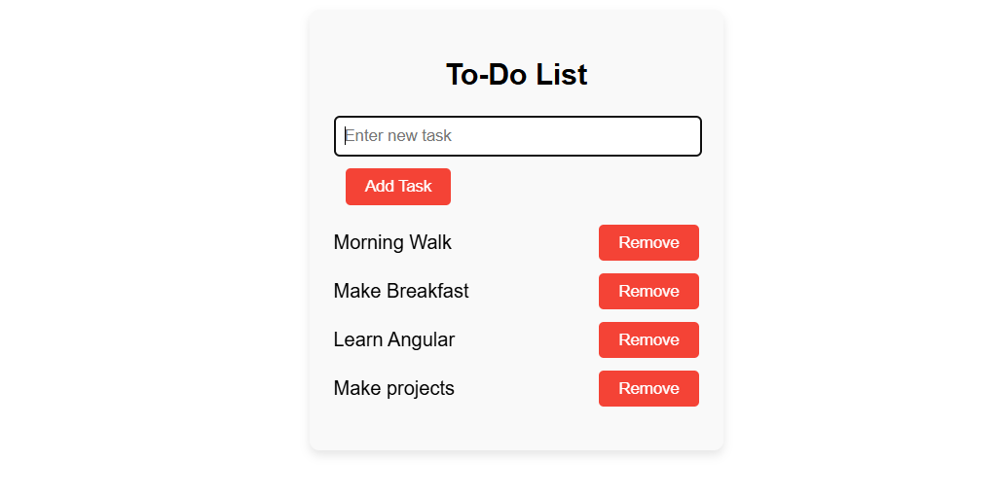

# AngularTodo ✅

This is a simple **To-Do List Application** built with **Angular 19**. It allows users to add and remove tasks in a clean and interactive interface. The project is ideal for beginners learning Angular basics such as data binding, event handling, and component structure.

---

## ✨ Features

- Add tasks to your to-do list
- Remove individual tasks
- Placeholder message when no tasks are available
- Instant updates without page reload
- Built with Angular standalone components

## 🧱 Technologies Used

- **Angular 19**
- **TypeScript**
- **HTML & CSS**

---

## 📸 Screenshot




---

## 🚀 Running the Project

To start the development server, run:

```bash
ng serve
